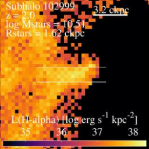
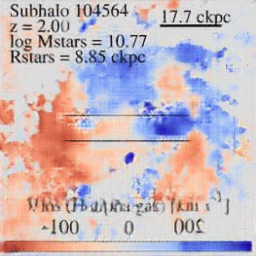

# DeepIllustris
DeepIllustris: Inferring Unobservable Structures of Galaxies fusing Simulation and Deep Learning

<html><body><table><tr><th>name</th><th>input</th><th>output</th><th>target</th></tr><tr><td>TNG50-1.33.102999</td><td></td><td></td><td></td></tr><tr><td>TNG50-1.33.104564</td><td></td><td></td><td></td></tr>
